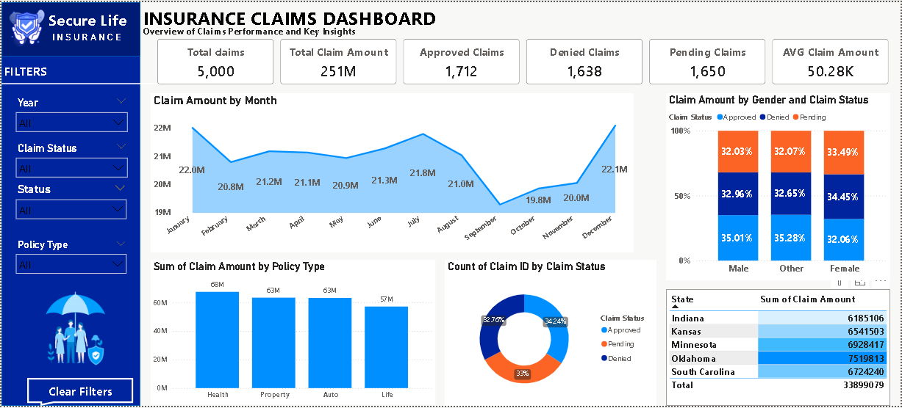
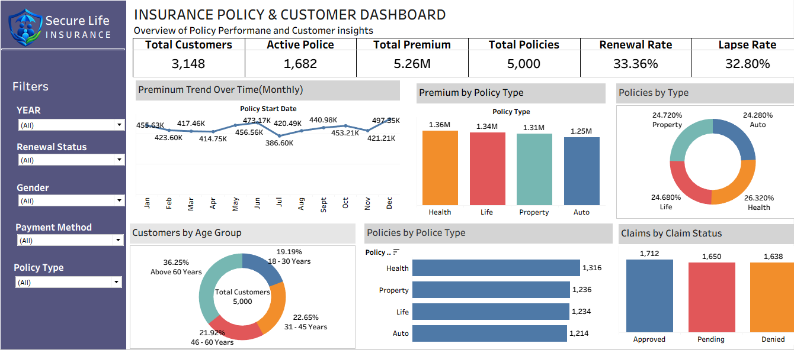
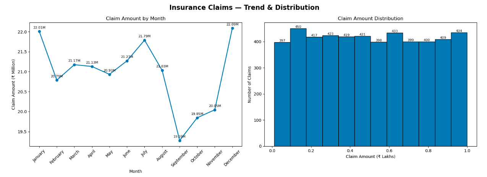
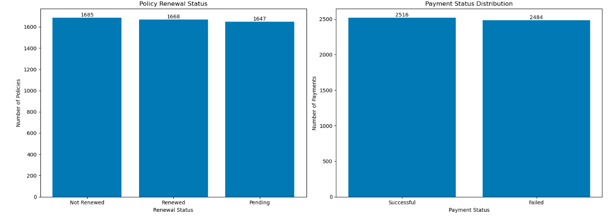
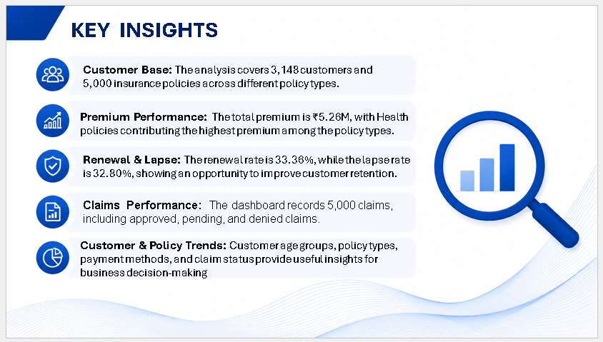
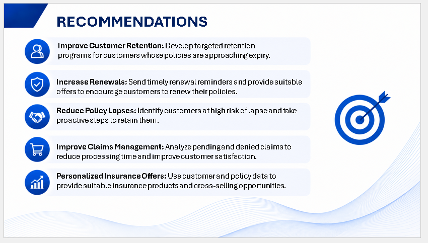

# SecureLife Insurance Data Analytics Project

---

## 📌 Project Overview

SecureLife Insurance Data Analytics is an end-to-end data analytics project focused on analyzing insurance customers, policies, premiums, claims, payments, renewals and business performance.

The project uses **SQL, Excel, Python, Power BI and Tableau** to transform insurance data into meaningful business insights and interactive dashboards.

---

## 🎯 Business Objectives

- Analyze overall insurance business performance
- Understand customer and policy trends
- Analyze premium collection
- Analyze different policy types
- Monitor policy renewals and lapses
- Analyze insurance claims
- Understand claim approval, pending and denial patterns
- Analyze payment status
- Identify customer age-group trends
- Analyze claim amounts
- Perform statistical analysis using Python
- Generate business insights and recommendations

---

## 🛠️ Tools & Technologies

- MySQL
- Microsoft Excel
- Python
- Pandas
- NumPy
- Matplotlib
- Power BI
- DAX
- Tableau

---

# 📊 Dashboards & Analysis

## 1. Power BI – Insurance Claims Dashboard

The Claims Dashboard analyzes:

- Total Claims
- Total Claim Amount
- Approved Claims
- Denied Claims
- Pending Claims
- Average Claim Amount
- Claim Amount by Month
- Claim Amount by Policy Type
- Claim Status Distribution
- Claim Amount by Gender
- Claim Amount by State

### Claims Dashboard Preview



---

## 2. Tableau – Insurance Policy & Customer Dashboard

Tableau was used to create interactive insurance dashboards and analyze:

- Total Customers
- Active Policies
- Total Premium
- Total Policies
- Renewal Rate
- Lapse Rate
- Premium Trend Over Time
- Premium by Policy Type
- Policies by Type
- Customers by Age Group
- Policies by Policy Type
- Claims by Claim Status

### Tableau Dashboard Preview



---

## 3. Python Statistical Analysis

Python was used for exploratory and statistical analysis.

### Analysis Includes

- Claim Amount by Month
- Claim Amount Distribution
- Policy Renewal Status
- Payment Status Distribution
- Policy Type Distribution
- Premium Amount by Policy Type

Libraries used:

- Pandas
- NumPy
- Matplotlib

### Python Analysis





---

# 📈 Key Business KPIs

The project analyzes important insurance KPIs including:

- Total Customers
- Total Policies
- Active Policies
- Total Premium
- Renewal Rate
- Lapse Rate
- Total Claims
- Total Claim Amount
- Approved Claims
- Pending Claims
- Denied Claims
- Average Claim Amount

---

# 🔍 Key Insights

The analysis provides insights into:

- Customer and policy distribution
- Premium performance across policy types
- Policy renewal and lapse behavior
- Claim approval and denial patterns
- Claim amount trends
- Customer age-group distribution
- Payment performance
- Policy type performance

### Key Insights



---

# 💡 Recommendations

Based on the analysis, the following recommendations can help improve insurance business performance:

- Improve customer retention through targeted renewal programs
- Send timely renewal reminders to customers
- Identify customers at high risk of policy lapse
- Improve claims processing efficiency
- Analyze pending and denied claims regularly
- Provide personalized insurance offers
- Identify cross-selling opportunities
- Monitor policy and claim KPIs regularly

### Recommendations



---

# 🔄 Project Workflow

**Raw Data → Data Cleaning → SQL Analysis → Python Analysis → Power BI → Tableau → Business Insights → Recommendations**

---

# 📁 Project Structure

```text
insurance-data-analytics/
│
├── README.md
│
├── Insurance_Data.xlsx
├── Insurance_Analysis.sql
├── Insurance_Dashboard.pbix
├── Insurance_Dashboard.twbx
├── Insurance_Python_Analysis.html
│
├── Power_BI_Dashboard.png
├── Tableau_Dashboard.png
├── Python_Analysis.png
├── Python_Analysis_2.png
├── Key_Insights.png
└── Recommendations.png
```

---

# 💡 Skills Demonstrated

- Data Cleaning
- Data Transformation
- SQL
- Exploratory Data Analysis
- Statistical Analysis
- Python Data Analysis
- Pandas
- NumPy
- Matplotlib
- Power BI
- DAX
- Tableau
- KPI Development
- Data Visualization
- Insurance Analytics
- Customer Analytics
- Claims Analytics
- Business Insights
- Business Recommendations

---

# 📌 Project Type

**Insurance Data Analytics**

---

# 👨‍💻 Perpaerdy by

**Mallikarjun**
